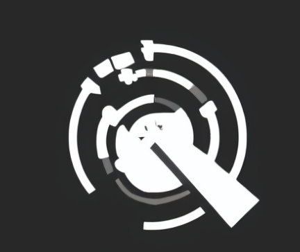
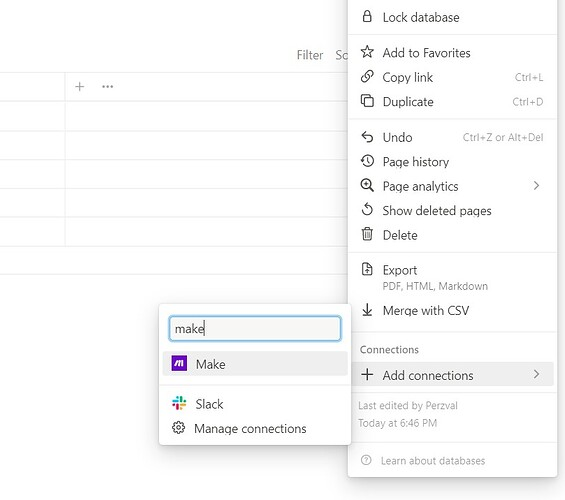

# NoRad
> Notion Random Page Fetcher

<p align="center">
  
</p>

This project is a Python script that interacts with the [Notion API](https://developers.notion.com/reference/intro) to fetch entries from specified databases and select a random page. It's designed to help users explore their Notion content in a dynamic and engaging way.

## Features
1. **Fetch Notion Database Entries**: Connects to the Notion API to retrieve entries from specified databases.
2. **Get a Random Page**: Randomly selects a page from the fetched entries and displays its title and URL.

## Getting Started
### Prerequisites
- Python 3.x
- Virtual environment (optional but highly recommended)
- [Notion API integration token](https://www.notion.so/profile/integrations)

### Installation
1. Clone the Repository
   ```
   git clone https://github.com/yourusername/NotionRandomPageFetcher.git
   cd NotionRandomPageFetcher
   ```
2. Create a Virtual Environment (I tend to do so in the inmediate upper folder)
   ```
   python -m venv ../venv
   source ../venv/bin/activate # On Windows, use `venv\Scripts\activate`
   ```
3. Install Required Packages
   ```
   pip install -r docs/requirements.txt
   ````

### Configuration
1. Create a `.env` File:
   - In the root directory of the project, create a file named `.env`.
2. Add your Notion Taken and Database IDs:
    - Replace `your_integration_token` with your actual Notion integration token.
    - List the database IDs you want to include, separated by commas and **without blank spaces**.
        ```
        NOTION_TOKEN=your_integration_token
        DATABASE_IDS=database_ide1,database_id2,database_ide3
        ```

###
Running the Script
1. Execute the Script:
   `python src/main.py`
2. Output:
   - The script will output the title and URL of a randomly selected page grom your specified Notion databases
        ```
        Random page selected: Fun Retrospectives
        Page URL: https://www.notion.so/Fun-Retrospectives-UUID
        ```

## Troubleshooting
- 400 Bad Request: Ensure that your database IDs and Notion token are correct and that the integration has access to the databases.
- 404 Not Found: Verify that the database IDs are accurate and that the integration is shared with the databases.


Image Source: https://community.make.com/t/setting-up-a-notion-watch-database-item-database-id-not-found/4064

## Contributing
Contributions are welcome! Please fork the repository and submit a pull request for any enhancements or bug fixes.